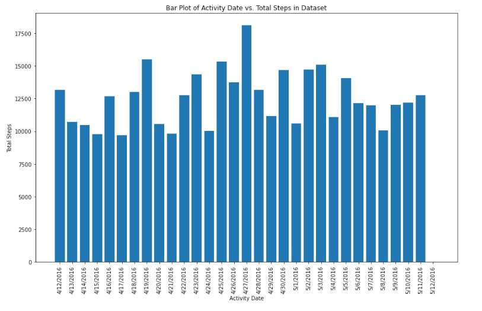
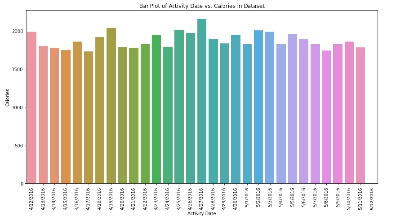
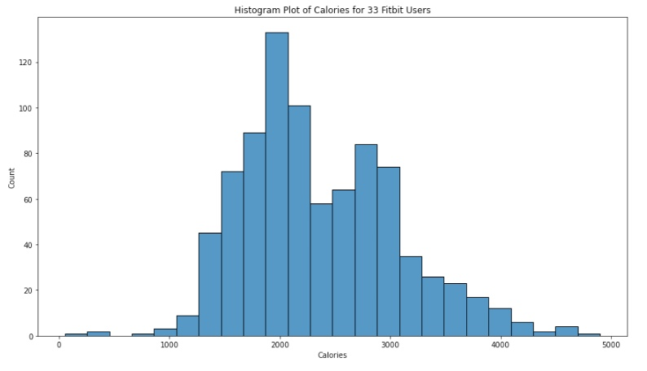

# Capstone Project 20.1: Initial Report and Exploratory Data Analysis (EDA)

**Creation of Machine Learning Models for Predicting Weight Loss using Exercise and Dietary Information**

**Author:** Rudy Silva Mera

## Executive Summary

Machine learning (ML), a branch of artificial intelligence, offers the potential to predict weight loss by analyzing patterns in behavior, such as changes in exercise and dietary habits. This project aims to leverage ML to create personalized weight loss plans, revolutionizing traditional approaches.

## Rationale

Weight loss is crucial for health, self-esteem, and life expectancy. This project addresses the need for effective weight loss strategies by utilizing ML to understand patterns in exercise and dietary data.

## Research Question

Several research questions will be explored, including the impact of specific exercises, the role of diet, and the influence of factors such as age, weight, and gender on weight loss.

## Data Sources

The project will utilize datasets from Fitbit weight loss and dietary information, available at:
- [Fitbit Weight Loss Dataset](https://www.kaggle.com/datasets/arashnic/fitbit)
- [Dietary Information Dataset](https://www.kaggle.com/datasets/tombenny/foodhabbits)

## Methodology

Machine learning models such as Linear Regression and Decision Trees will be employed to predict weight loss based on exercise and dietary data. Additionally, classifiers like K Nearest Neighbors (KNN), Logistic Regression, and Support Vector Machines (SVC) will be compared for accuracy.

## Results

### Results

#### Data Visualization 

As mentioned above, in exploring the dataset, a number of visualization was created to understand the distribution of weight loss information in the dataset. An example is the chart below that shows the number of steps taken by a Fitbit user during the period of 4/12/2016 to 5/12/2016.

The average number of steps for this user is approximately 12,000 and supports the average Calories recorded below.

With the average number of steps above, how does this translates to average number of calories. The chart below shows the number of calories lost by this user over the same period of 4/12/2016 to 5/12/2016.

This User is a fairly active users over the number of days in the dataset with average of 1816 calories over the number of days above

Finally, a visualization of the final data used to create the ML applications looking at the count of the Calories lost by all 33 Fitbit users.

The chart shows that largest amount of Calories lost recorded by users at 2,000, a fair distribution of calories lost data from 1,400 to 4,000 which means the ML Application would probably make better predictions for users that have recorded their number of steps and other variables in the data against these calories.

#### AI Application/Solutions

##### AI Application 1 - ML Regressors

Regressors are a type of ML algorithms that can be used to predict a continuos value. The do this by learning from data (i.e., number of steps taken, total distance etc.) and then using that data to create a model that can make predictions about new data (i.e., number of calories lost)

The application uses variables like Total Distance and No of Steps taken to predict number of calories that a user could lose.

`Algorithm`: GradientBoostingRegressor

|        	|                    | 
|-------------------	|:---------------------------	|
| Training Score    | 85%                     |  
| Test Score         | 61%                       |  
|                       |                               |

This algorithm can predict calories loss with an accuracy of over 60%+

##### AI Application 2 - Decision Tree Classifier (DTC)

DTC is a ML model   that can be used to classify data. It does this by building tree of decisions based on the value of a variable (I.e., no of steps etc.).  

The tree is then used to classify new data like weight loss flag 

`Algorithm`: DecisionTreeClassifier

|        	|                    | 
|-------------------	|:---------------------------	|
| Training Score    | 62%                     |  
| Test Score        | 63%                       |  
|                       |                               |

This algorithm can predict weight loss with an accuracy of over 60%+

##### AI Application 3 - ML Classifications

ML Classifications uses a process of dividing data into groups based on shared characteristics.  

The goal of classification is to identify patterns (i.e., no of steps taken etc.) in the data and use those patterns to predict the class of new data points (i.e., weight loss)

`Algorithm`: K-Nearest Neighbor (KNN)

|        	|                    | 
|-------------------	|:---------------------------	|
| Training Score    | 75%                     |  
| Test Score        | 59%                       |  
|                       |                               |

This algorithm can predict weight loss with an accuracy of over 60%+

#### Important Findings  

Three notebooks are included in this project which demonstrates that a number of Machine Learning (ML) models can be used to predict the number of calories loss and whether a person can lose weight.

The models used data from 33 Fitbit users over a period of a month. The model prediction provided training accuracy of 65% to 100% depending on the ML algorithms. Predict weight loss and number of calories lost with an accuracy of 65% to 100%. These ML algorithms will be deployed to create the AI applications with endpoints that users can call with input variables (i.e., number of steps, total distance etc.) and the applications will return number of predicted calories loss or a weight loss flag.

Each notebook includes a Findings section for the models, but a summary is as follows:
- For AI application 1, we tried a number of models with all the variables and a couple of strong inputs (i.e., Total Steps and Total Distance) . The model provided an accuracy score of 62% to 100% for training and 37% to 67% for test. Important Variables were Total Steps and Total Distance
- For AI application 2, the models produced an average accuracy score is in the 60% range
- For AI application 3, the K-Nearest Neighbor (KNN) had the best training score of 75% and test score of 58%

### Project Outline

- [Notebook 1 - Linear Regression]
- [Notebook 2 - Decision Tree Classifier]
- [Notebook 3 - Comparing Classifiers]

